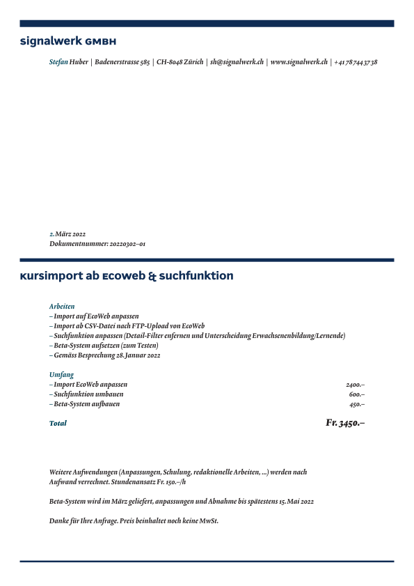
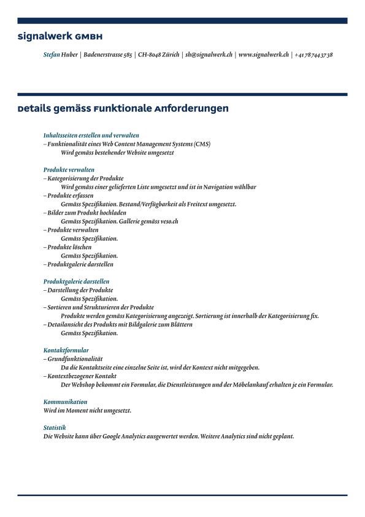
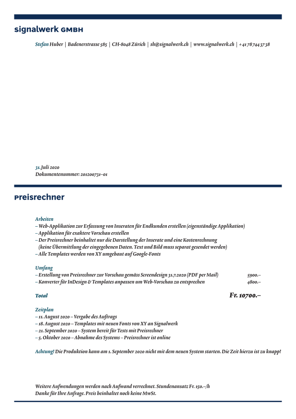

```fm
style: negative
background: true
```

## Hello _👋_

# {{process.content.frontmatter.title}}

_Ein Austausch für Dienstleistende_

<footer>

2024 · Zurich · Stefan Huber

</footer>

--s--

```fm
style: image
background:
  image: https://portrait.signalwerk.ch/illustration/2020/rgb/w4000/stefan-huber.jpg
  position: 50% 40%
```

## Stefan

<div class="box box--w40p box--bottom box--white box--padding small">

- Developer | 16 Jahre selbständig
- ❦ Typography

</div>

<footer class="footer--right">

Illustration by [Benjamin Güdel](http://www.guedel.biz/) · 2020

</footer>

--s--

## Agenda

- Input Stefan
- Input Matthias
- Newnion

> 30 – 45 Minuten

--s--

```fm
style: negative
background: true
```

## Austausch

# Grätscht dazwischen

--s--

## Let's start

# Offerte

--s--

## Allgemeine Überlegungen

- Brauch ich den **Kunden/Auftrag**?
- Brauch ich _Schmerzensgled_?

--s--

## Beispiel

- Alles auf der _1. Seite_
- _Was_ mach ich
- Was kostet es
- **Optionen** ausweisen
- Kostendach
- Timeline
- CHF/h

<div class="box box--w50p box--img-cover box--right" style="background-color: #f0f0f0">



</div>

--s--

## Folgeseite

- Folgeseite <br>interessiert Niemanden...
- Enttäuschung vermeiden

<div class="box box--w50p box--img-cover box--right" style="background-color: #f0f0f0">



</div>

--s--

## Timeline

- Kurzer Überblick
- Enttäuschung vermeiden

<div class="box box--w50p box--img-cover box--right" style="background-color: #f0f0f0">



</div>

--s--

## Auftrag

- Darf die Person wirklich Auftäge geben?
- Ist die Offerte noch aktuell?

--s--

## Rechnung

- _Neukunden_ 50 % Vorauszahlung
- **30 Tage** Rechnungsfrist
- Bei langen Projekten **monatlich**
- Noch nie unbezahlte Rechnung

--s--

## Rechnung

- Rabatte und Kostendach-<br>überschreitungen <br>immer **aufzeigen**

<div class="box box--w50p box--img-cover box--right" style="background-color: #f0f0f0">


</div>

--s--

```fm
style: negative
background: true
```

## Sonstiges

# Werkverträge

--s--

## Werkverträge

- **Werkvertrag** · Was macht ihr für wieviel Geld für wen
- _Lizenzvertrag_ · Was darf der/die Kund·in damit machen
- Werkvertrag und Lizenzvertrag ist unterschiedlich
- Werkverträge: Bis jetzt zweimal gebraucht
- Lizenzverträge: Bis jetzt einmal gebraucht
- [Muster Werkvertrag](https://newnion.org/documents/vorlage/werkvertrag/)

--s--

```fm
style: negative
background: true
```

## Danke

# Fragen?

--s--

```fm
style: negative
background: true
```

## Next

# Matthias

--s--

```fm
style: negative
background: true
```

## Fragen!

- Braucht ihr Werkverträge?
- Wie ist die Zahlungsmoral und wie geht ihr damit um?

--s--

```fm
style: negative
background: true
```

## Wer sind wir?

# Newnion

- Kontakt
